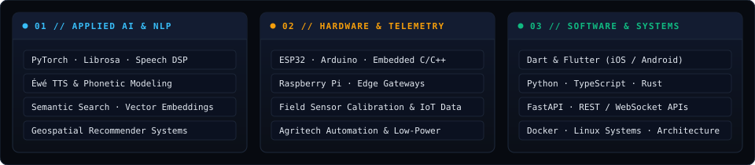

<div align="center">
  
</div>

<br/>

## // PROFIL & VISION D'INGÉNIERIE

Je conçois des systèmes techniques de bout en bout, là où le matériel, la donnée et le logiciel convergent. 

Mon travail se concentre sur la résolution de problèmes réels à fort impact : adapter l'intelligence artificielle aux contextes africains (notamment le traitement de la parole et le NLP pour les langues locales comme l'**Éwé**), concevoir des nœuds télémétriques **IoT** pour le terrain agricole, et développer des applications mobiles et distribuées véloces et résilientes.

```
[ CAPTEURS & TÉLÉMÉTRIE ]  ──>  [ MODÈLES ACOUSTIQUES & NLP ]  ──>  [ INTERFACES FLUTTER & WEB ]
        (ESP32 / Edge)                   (PyTorch / Éwé TTS)                (Mobile / Cloud APIs)
```

---

## // SYSTÈMES & PROJETS PHARE

<table>
  <tr>
    <td width="50%" valign="top">
      <h3>01 / Yawo — IA Vocale & TTS en Langue Éwé</h3>
      <p><strong>Moteur de synthèse vocale adapté aux spécificités tonales et phonétiques des langues ouest-africaines.</strong></p>
      <ul>
        <li>Transcription phonétique et modélisation acoustique prenant en compte les contours tonals essentiels au sens en Éwé.</li>
        <li>Conçu pour combler le fossé numérique auprès des populations non alphabétisées (accès aux services essentiels, éducation, santé).</li>
        <li><strong>Stack :</strong> Python, PyTorch, Librosa, Traitement du Signal Audio, NLP.</li>
      </ul>
    </td>
    <td width="50%" valign="top">
      <h3>02 / AgriFlow — Télémétrie Agricole & Guidage Vocal</h3>
      <p><strong>Écosystème IoT et d'aide à la décision agricole en conditions réelles et basse connectivité.</strong></p>
      <ul>
        <li>Collecte et analyse de métriques sols et micro-climatiques via des sondes et nœuds autonomes basse consommation.</li>
        <li>Restitution des recommandations agronomiques en langue locale Éwé via le moteur Yawo pour les producteurs de terrain.</li>
        <li><strong>Stack :</strong> ESP32, C/C++, Réseaux de capteurs, Edge AI, API Backend.</li>
      </ul>
    </td>
  </tr>
  <tr>
    <td width="50%" valign="top">
      <h3>03 / Tchaller — Moteur Géospatial Intelligent</h3>
      <p><strong>Plateforme de découverte contextuelle et d'indexation de services de proximité en temps réel.</strong></p>
      <ul>
        <li>Algorithmes de géolocalisation haute précision et vérification dynamique de disponibilité de services urbains.</li>
        <li>Recommandations contextuelles basées sur la proximité géographique et la pertinence locale.</li>
        <li><strong>Stack :</strong> Flutter, Indexation Spatiale, REST APIs, GeoJSON.</li>
      </ul>
    </td>
    <td width="50%" valign="top">
      <h3>04 / Skollab & Echo — Plateformes Mobiles & Temps Réel</h3>
      <p><strong>Infrastructures applicatives pour communautés étudiantes et créateurs de contenu.</strong></p>
      <ul>
        <li><strong>Skollab :</strong> Marketplace mobile de mise en relation intelligente entre marques et créateurs avec flux de collaboration automatisés.</li>
        <li><strong>Echo :</strong> Réseau d'expression étudiant temps réel, anonymisé et sécurisé, optimisé pour la fluidité d'échange.</li>
        <li><strong>Stack :</strong> Flutter, Dart, WebSockets, Architectures d'APIs asynchrones.</li>
      </ul>
    </td>
  </tr>
</table>

---

## // ARSENAL TECHNIQUE & MATRICE DE COMPÉTENCES

<div align="center">
  
</div>

<br/>

### Détail des environnements de travail

| Domaine | Technologies & Outils |
| :--- | :--- |
| **Applied AI & Audio** | PyTorch, NLP, TTS (Synthèse vocale), Traitement du signal (DSP), Vector Embeddings, NLTK |
| **Systèmes Embarqués & IoT** | ESP32, Arduino, Raspberry Pi, Capteurs télémétriques, Prototypage hardware, Linux embarqué |
| **Développement Produit** | Dart / Flutter (iOS & Android), Python (FastAPI), TypeScript, Vue.js, Architecture logicielle |
| **Infrastructure & Ops** | Docker, Git, Linux (SysAdmin, Shell), CI/CD, Intégrations API REST & WebSockets |

---

## // PRINCIPES DE CONCEPTION

```
01. CONTEXT-FIRST     L'ingénierie doit répondre aux réalités locales (basse connectivité, langues tonales).
02. FULL-PIPELINE     Maîtrise de la chaîne complète : de l'électronique de capture à l'UX finale.
03. NO UNNECESSARY    Des architectures robustes, mesurables et dénuées de complexité superflue.
```

---

## // ME CONTACTER & COLLABORER

Je suis disponible pour des missions d'architecture, de R&D appliquée (IA vocale, IoT, NLP langues africaines) et le développement de produits technologiques ambitieux.

```bash
$ contact --developer "Joël Elisée Adzonya"
> Portfolio  : https://joel.adzonya.strivenew.com
> Email      : joeleliseeadzonya@gmail.com
> WhatsApp   : +228 91 38 87 62 (https://wa.me/22891388762)
> Localité   : Lomé, Togo (UTC+0)
```

<div align="center">
  <sub>Conçu avec précision • Joël Elisée Adzonya</sub>
</div>
