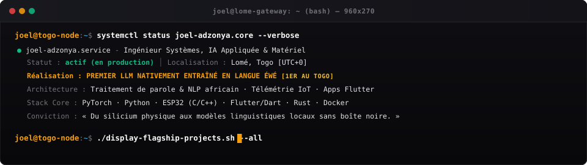

<div align="center">

  <!-- Master Terminal CLI Window -->
  

  <br/><br/>

  <!-- Circular Profile Avatar -->
  <a href="https://joel.adzonya.strivenew.com">
    
  </a>

  <br/>

  <!-- Dynamic Typing Telemetry -->
  <a href="https://github.com/joel710">
    
  </a>

</div>

<br/>

```bash
$ ./systems --inspect --scope=flagships --verbose
```

```
========================================================================================
01. [MILESTONE] PREMIER LLM NATIVEMENT ENTRAÎNÉ EN LANGUE ÉWÉ (1ER AU TOGO)
========================================================================================
- Rôle         : Concepteur, Chercheur & Ingénieur ML
- Percée       : Modèle de langage génératif pré-entraîné *from scratch* directement en langue
                 Éwé (sans transiter par l'anglais ou le français).
- Problème     : Rareté critique de corpus structuré et échec des tokenizers occidentaux sur 
                 les caractères diacritiques et les variations tonales d'Afrique de l'Ouest.
- Solution     : Construction du dataset natif, tokenizer BPE/Byte-level customisé respectant
                 la grammaire tonale et pré-entraînement ciblé pour génération contextuelle.
- Stack        : PyTorch · Transformers · Tokenizers Custom · Python · GPU Compute

========================================================================================
02. YAWO — SYNTHÈSE VOCALE (TTS) & MODÉLISATION ACOUSTIQUE ÉWÉ
========================================================================================
- Rôle         : Architecte Audio & NLP
- Percée       : Moteur TTS prenant en compte les contours intonatifs et formants de l'Éwé.
- Impact       : Passerelle audio pour rendre l'information accessible aux populations non-lectrices.
- Stack        : Python · PyTorch · Librosa · DSP Audio · Vocodeur Neural

========================================================================================
03. AGRIFLOW — TÉLÉMÉTRIE IOT DE TERRAIN & GUIDAGE VOCAL AGRICOLE
========================================================================================
- Rôle         : Concepteur Systèmes Embarqués & Hardware
- Percée       : Nœuds de sondes solaires autonomes pour la capture d'humidité et métriques sols
                 en environnement à faible connectivité avec restitution vocale en Éwé hors-ligne.
- Stack        : ESP32 · C/C++ · Instrumentation Capteurs · Flash Buffer · Offline-First

========================================================================================
04. TCHALLER, SKOLLAB & ECHO — MOTEUR SPATIAL & APPLICATIONS TEMPS RÉEL
========================================================================================
- Tchaller     : Indexation spatiale dynamique de services urbains à proximité (< 25ms).
- Skollab      : Plateforme mobile de mise en relation et scoring automatique marques-créateurs.
- Echo         : Réseau social étudiant anonymisé, temps réel et optimisé pour faible débit.
- Stack        : Flutter · Dart · WebSockets · Fast GeoJSON · Microservices REST
```

<br/>

```bash
$ sysctl --capabilities --format=matrix
```

```
[DOMAINE]                [TECHNOLOGIES & OUTILS]
Applied AI & LLMs   ==>  PyTorch · Transformers · Tokenizers · NLP · DSP Audio · NLTK
Systèmes & Hardware ==>  ESP32 · Arduino · Raspberry Pi · C/C++ · Télémétrie · Linux Embarqué
Mobile & Frontend   ==>  Flutter · Dart · TypeScript · Vue.js · WebSockets · REST APIs
DevOps & Tooling    ==>  Docker · Linux (Debian/Arch) · Git · CI/CD · Bash Scripting
```

<br/>

<div align="center">

<a href="https://skillicons.dev">
  
</a>

</div>

<br/>

```bash
$ curl -s https://joel.adzonya.strivenew.com/api/v1/ping | jq .
```

```json
{
  "author": "Joël Elisée Adzonya",
  "role": "Ingénieur Systèmes, IA Appliquée & Systèmes Embarqués",
  "flagship": "Premier LLM nativement entraîné en Éwé (Togo)",
  "location": "Lomé, Togo [UTC+0]",
  "endpoints": {
    "portfolio": "https://joel.adzonya.strivenew.com",
    "email": "joeleliseeadzonya@gmail.com",
    "whatsapp": "+228 91 38 87 62 (https://wa.me/22891388762)",
    "github": "https://github.com/joel710"
  },
  "status": "Ouvert aux projets de R&D, collaborations deep-tech & architectures à fort impact"
}
```

<br/>

<div align="center">
  <sub>Lomé, Togo • Joël Elisée Adzonya • joel710</sub>
</div>
