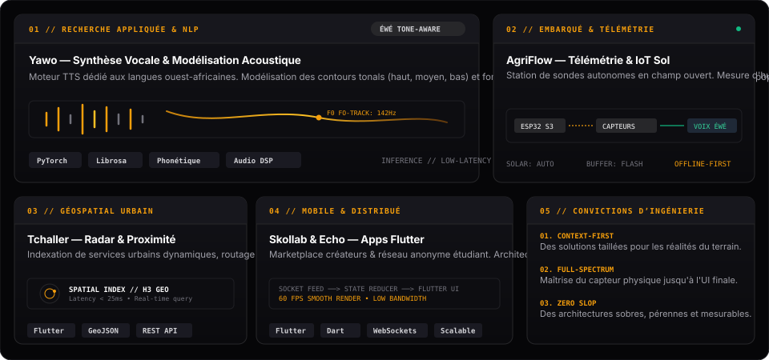
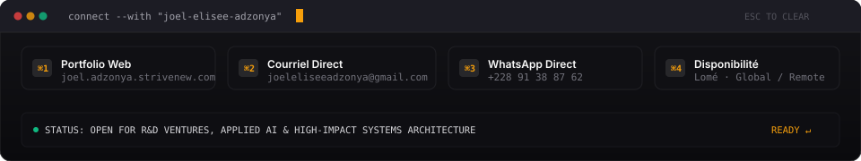

  <!-- Master Hero Header -->
  

    

  <!-- Circular Profile Portrait -->
  

    

  <!-- Dynamic Typing Telemetry -->
  

 

---

### // 01. BENTO ARCHITECTURE & PROJETS

  

 

<strong>▸ Spécifications techniques détaillées des systèmes</strong>

 

#### 1. Yawo — Synthèse Vocale & Traitement de la Parole en Langue Éwé
* **Problématique :** La majorité des moteurs vocaux mondiaux échouent sur les langues ouest-africaines à tons, où la variation de hauteur (pitch) modifie radicalement le sens d'un même phonème.
* **Architecture :** Pipeline de transcription phonétique adaptée, modélisation acoustique du contour tonal ($F_0$), et vocodeur neural basse latence optimisé pour l'inférence locale.
* **Impact :** Accès numérique universel, services d'information agricole et médicale pour populations non-lectrices.
* **Technologies :** `Python`, `PyTorch`, `Librosa`, `Audio DSP`, `Phonetic Parsing`.

#### 2. AgriFlow — Station Télémétrique & Décision Agronomique de Terrain
* **Problématique :** Manque d'infrastructures de données et de connectivité continue dans les exploitations agricoles locales.
* **Architecture :** Nœuds de capteurs autonomes (ESP32) mesurant humidité du sol, température et hygrométrie avec stockage tampon flash et synchronisation asynchrone. Restitution des alertes en synthèse vocale Éwé via le moteur Yawo.
* **Technologies :** `ESP32`, `C/C++`, `Sensor Instrumentation`, `LoRa / GSM`, `Edge AI`.

#### 3. Tchaller — Moteur Géospatial Contextuel
* **Problématique :** Découverte instantanée et vérification de disponibilité de services urbains décentralisés.
* **Architecture :** Indexation spatiale dynamique par maillage géographique, requêtes à rayon variable et latence inférieure à 25ms.
* **Technologies :** `Flutter`, `Spatial Indexing`, `Fast GeoJSON`, `REST APIs`.

#### 4. Skollab & Echo — Plateformes Mobiles Réactives
* **Skollab :** Algorithme de mise en relation et scoring intelligent entre marques et créateurs de contenu avec gestion de campagnes intégrée.
* **Echo :** Réseau social temps réel pour communautés universitaires axé sur l'anonymat, la liberté d'expression et la faible consommation de données.
* **Technologies :** `Flutter`, `Dart`, `WebSockets`, `Asynchronous Microservices`.

---

### // 02. ARSENAL TECHNIQUE & OUTILS

#### Intelligence Artificielle & Audio DSP

 

#### Systèmes Embarqués & Télémétrie

 

#### Ingénierie Produit & Mobile

 

#### DevOps & Infrastructure

 

---

### // 03. COMMAND PALETTE & CONTACT

  

 

| Destination | Raccourci | Lien Direct |
| :--- | :---: | :--- |
| **Portfolio Personnel** | `⌘1` | [joel.adzonya.strivenew.com](https://joel.adzonya.strivenew.com) |
| **Email Direct** | `⌘2` | [joeleliseeadzonya@gmail.com](mailto:joeleliseeadzonya@gmail.com) |
| **WhatsApp Business** | `⌘3` | [+228 91 38 87 62](https://wa.me/22891388762) |
| **GitHub Profil** | `⌘4` | [github.com/joel710](https://github.com/joel710) |

 

  Conçu avec précision • Joël Elisée Adzonya • Lomé, Togo (UTC+0)

